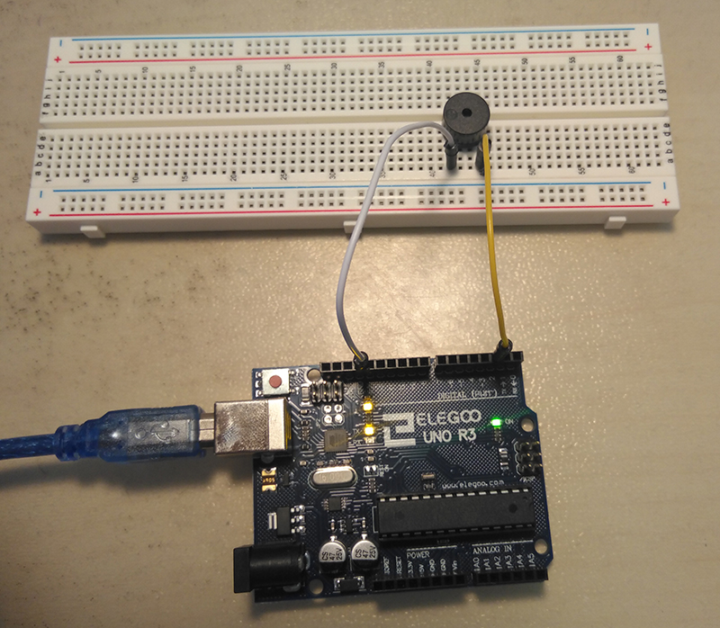

# tiny-tune
This is a sample program that plays a tune on an Arduino. The program has been optimized to consume
as little SRAM (variable memory) as possible for long melodies. Furthermore, other code can
be executed while music is being played, since no delays are used to play the music.

Tested on an Arduino UNO.

In order to run the program, compile and upload the following files to your Arduino:
- tiny-tune.ino
- tunes.ino
- pitches.h
- libraries/ArduinoThread (library by Ivan Seidel)

Use playTune() to start playing the tune. Use cancelTune() to stop playing the tune. Edit getTuneData() in tunes.ino to change the sample tune or add your own tunes.

This is the hardware setup I used for testing:

